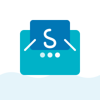

# Smoothstack

<div align="center">
  
  <p>
    <strong>现代化全栈应用开发框架 | Modern Full-Stack Application Development Framework</strong>
  </p>
  <p>
    <a href="#核心特性">核心特性</a> •
    <a href="#技术栈">技术栈</a> •
    <a href="#快速开始">快速开始</a> •
    <a href="#容器化开发与依赖管理">容器化开发与依赖管理</a> •
    <a href="#架构概览">架构概览</a> •
    <a href="#使用场景">使用场景</a> •
    <a href="#示例应用">示例应用</a> •
    <a href="#扩展指南">扩展指南</a> •
    <a href="#贡献指南">贡献指南</a>
  </p>
</div>

## 项目愿景

Smoothstack 致力于解决全栈开发中的环境配置痛点，让开发者将精力集中在业务逻辑实现上，而非繁琐的环境搭建与依赖管理。通过 Docker 容器化技术和自动化脚本，提供一键式开发环境部署，实现「**配置即代码**」的开发理念。

> 💡 **核心理念**：环境搭建不应成为开发瓶颈，依赖管理不应消耗创造力。

## 核心特性

- 🚀 **一键式环境部署**：5分钟内完成从零到可用的全栈开发环境搭建
- 🐳 **Docker 容器化管理**：隔离的开发环境确保"我这能运行"就是"到处能运行"
- 💻 **跨平台兼容**：Windows、macOS、Linux 全平台支持，消除"在我电脑上能跑"的问题
- 📦 **自动化依赖管理**：前后端依赖统一管理，版本锁定与冲突检测
- 🌍 **多环境支持**：开发、测试、预发布、生产环境配置分离与一键切换
- 🔄 **双语言整合**：无缝集成 JavaScript/TypeScript 前端与 Python 后端的开发体验
- 🧩 **模块化架构**：可插拔组件设计，按需引入所需功能
- 🛠️ **开发体验优先**：热重载、智能日志、调试工具链一应俱全
- 🌐 **多语言与国际化**：内置i18n支持，便捷的语言切换机制
- 📊 **数据可视化支持**：集成专业图表库，快速构建数据驱动的应用
- 🔌 **高度可扩展**：模块化设计使您可以仅使用需要的部分

## 技术栈

### 前端技术栈

- **核心框架**：[Vue 3](https://v3.vuejs.org/) + [TypeScript](https://www.typescriptlang.org/)
- **构建工具**：[Vite](https://vitejs.dev/) (开发服务器和构建工具)
- **UI 框架**：[Ant Design Vue](https://antdv.com/docs/vue/introduce-cn)
- **状态管理**：[Pinia](https://pinia.vuejs.org/)
- **路由管理**：[Vue Router](https://router.vuejs.org/)
- **桌面应用框架**：[Electron](https://www.electronjs.org/) (可选)
- **HTTP 客户端**：[Axios](https://axios-http.com/)
- **工具库**：[lodash](https://lodash.com/)、[dayjs](https://day.js.org/)
- **CSS 预处理**：[SCSS](https://sass-lang.com/)
- **数据可视化**：[ECharts](https://echarts.apache.org/) (强大的图表库)
- **国际化解决方案**：[Vue I18n](https://vue-i18n.intlify.dev/) (多语言支持)
- **组合式API工具**：[VueUse](https://vueuse.org/) (实用的组合式API集合)

### 后端技术栈

- **核心语言**：[Python 3.8+](https://www.python.org/)
- **数据库**：[SQLite](https://www.sqlite.org/) (默认) / 可扩展支持 PostgreSQL、MySQL
- **API 框架**：内置 Python API 服务，可扩展支持 [FastAPI](https://fastapi.tiangolo.com/)
- **异步任务**：可选集成 [Celery](https://docs.celeryq.dev/)
- **ORM**：可选集成 [SQLAlchemy](https://www.sqlalchemy.org/)
- **跨语言通信**：JavaScript-Python桥接

### 容器化与环境管理

- **容器技术**：[Docker](https://www.docker.com/) + [docker-compose](https://docs.docker.com/compose/)
- **容器化开发**：支持 [VS Code Dev Containers](https://code.visualstudio.com/docs/remote/containers)
- **环境管理**：Python 虚拟环境 + Node.js 版本管理
- **CI/CD 支持**：提供 GitHub Actions 工作流模板

### 测试框架

- **前端测试**：[Vitest](https://vitest.dev/) / [Jest](https://jestjs.io/) (单元测试)
- **组件测试**：[Vue Test Utils](https://test-utils.vuejs.org/)
- **端到端测试**：[Cypress](https://www.cypress.io/) (可选)
- **后端测试**：[pytest](https://pytest.org/) (Python测试框架)
- **API测试**：[Postman](https://www.postman.com/) / [Insomnia](https://insomnia.rest/) (可选)

## 快速开始

### 前提条件

- 已安装 [Docker](https://www.docker.com/get-started) 和 [docker-compose](https://docs.docker.com/compose/install/)
- 在 Windows 环境需安装 [Git Bash](https://gitforwindows.org/) 或启用 WSL2

### 基础使用

1. **克隆项目**
```bash
git clone https://github.com/yourusername/smoothstack.git
cd smoothstack
```

2. **环境初始化**
```bash
# 一键设置所有开发环境依赖
./start.sh setup

# 使用中国镜像源加速依赖下载（可选）
./start.sh setup --cn
```

3. **启动开发环境**
```bash
# 启动开发模式（支持热重载）
./start.sh run

# 查看系统状态
./start.sh status
```

4. **访问应用**
- 前端开发服务器：http://localhost:3000
- 桌面应用：自动启动
- API服务：http://localhost:5000

### 常用命令

```bash
# 显示帮助信息
./start.sh help

# 停止所有服务
./start.sh stop

# 查看日志
./start.sh logs

# 重启服务
./start.sh restart

# 依赖管理
./start.sh deps install <package>  # 安装依赖包
./start.sh deps update <package>   # 更新依赖包
./start.sh deps list               # 列出已安装的依赖包

# 开发日志管理
./start.sh system log create --tags "前端,Docker"  # 创建新的开发日志
./start.sh system log search --tag Docker          # 搜索包含指定标签的日志
./start.sh system log update-all                   # 更新日志索引和统计报告

# 源管理
./start.sh sources list            # 列出可用的源
./start.sh sources cn              # 切换至中国镜像源
./start.sh sources us              # 切换至官方源

# Docker管理
./start.sh docker image list       # 列出Docker镜像
./start.sh docker image pull <image>  # 拉取Docker镜像
./start.sh docker container list   # 列出Docker容器

# Python API版Docker管理
./start.sh py-docker container list  # 使用Python API列出容器
./start.sh py-docker image list      # 使用Python API列出镜像
```

### Docker 管理工具

Smoothstack 提供三种 Docker 管理方式，满足不同使用场景：

#### 1. docker-mgr - 统一的Docker管理工具 (推荐)

特点：自动选择最佳实现方式（Python API或CLI），美观的界面和详细的错误处理。

```bash
# 基本使用（自动选择最佳实现）
./start.sh docker-mgr container list   # 列出所有容器
./start.sh docker-mgr image list       # 列出所有镜像

# 指定实现方式
./start.sh docker-mgr --mode cli container list    # 强制使用CLI方式
./start.sh docker-mgr --mode api container list    # 强制使用Python API

# 纯文本输出（适合脚本使用）
./start.sh docker-mgr --plain container list
```

#### 2. docker - 基于 Docker CLI 的工具

特点：轻量级，直接调用 Docker 命令，无需额外依赖。

```bash
# 镜像管理
./start.sh docker image list       # 列出所有镜像
./start.sh docker image pull nginx # 拉取镜像
./start.sh docker image rm nginx   # 删除镜像
./start.sh docker image build -t myapp:1.0 .  # 构建镜像

# 容器管理
./start.sh docker container list   # 列出容器
./start.sh docker container start my-container  # 启动容器
./start.sh docker container stop my-container   # 停止容器
```

#### 3. py-docker - 基于 Python Docker API 的工具

特点：美观的界面、详细的错误处理和高级功能。

```bash
# 镜像管理
./start.sh py-docker image list    # 美观表格展示所有镜像
./start.sh py-docker image pull nginx:latest  # 拉取镜像
./start.sh py-docker image rm nginx:latest    # 删除镜像

# 容器管理
./start.sh py-docker container list  # 美观表格展示所有容器
./start.sh py-docker container logs my-container  # 查看容器日志
./start.sh py-docker container exec my-container "ls -la"  # 在容器中执行命令
```

> **✨ 推荐使用 `docker-mgr` 命令**：它能自动选择最佳实现方式，提供一致的用户体验，并具备更全面的错误处理和兼容性。

### 关于命令接口

虽然Smoothstack的底层实现已经从Bash脚本迁移到了Python (基于[重构方案](docs/重构方案.md))，但我们仍然保留了`start.sh`作为用户接口入口点，以提供平滑的过渡体验：

- **底层实现**: 所有核心功能均由Python模块实现，提供更好的跨平台兼容性和功能扩展性
- **命令接口**: 保留Shell脚本作为简单入口点，内部调用Python实现
- **为什么这样做**: 确保向后兼容性，让现有用户和自动化脚本无需立即调整
- **未来发展**: 长期计划提供纯Python CLI命令 (`smoothstack` 或 `python -m smoothstack_cli`)

**技术实现**:
```bash
# start.sh 内部实际上执行的是
python -m smoothstack_cli "$@"
```

## 容器化开发与依赖管理

Smoothstack 提供了强大的容器化开发环境和依赖管理工具，使团队开发更加高效和一致。

### 容器管理

使用以下命令管理Docker容器:

```bash
# 容器管理 (使用Python Docker API)
./start.sh system py-docker container list       # 列出所有容器
./start.sh system py-docker container create     # 创建新容器
./start.sh system py-docker container start      # 启动容器
./start.sh system py-docker container stop       # 停止容器
```

### 依赖管理

Smoothstack提供统一的依赖管理工具，支持前端和后端依赖:

```bash
# 容器内依赖管理
./start.sh system deps container frontend add <pkg>     # 添加前端依赖
./start.sh system deps container backend add <pkg>      # 添加后端依赖
./start.sh system deps container frontend remove <pkg>  # 移除前端依赖
./start.sh system deps container backend list           # 列出后端依赖

# 依赖安全检查
./start.sh system deps security check frontend          # 检查前端依赖安全漏洞
./start.sh system deps security check backend           # 检查后端依赖安全漏洞
./start.sh system deps security check all               # 检查所有依赖安全漏洞

# 依赖可视化
./start.sh system deps visualize frontend               # 前端依赖关系图可视化
./start.sh system deps visualize backend                # 后端依赖关系图可视化
./start.sh system deps tree frontend                    # 查看前端依赖树结构
./start.sh system deps tree backend                     # 查看后端依赖树结构

# Dockerfile模板管理
./start.sh system deps template list                    # 列出Dockerfile模板
./start.sh system deps template view <name>             # 查看指定模板
./start.sh system deps template edit <name>             # 编辑指定模板
./start.sh system deps template apply <name>            # 应用指定模板并重建镜像
```

### 其他工具

```bash
# 检查依赖冲突
./start.sh system deps check frontend                   # 检查前端依赖冲突
./start.sh system deps check backend                    # 检查后端依赖冲突

# 依赖版本控制
./start.sh system deps lock frontend                    # 锁定前端依赖版本
./start.sh system deps restore frontend                 # 从锁定文件恢复依赖
./start.sh system deps export frontend <file>           # 导出依赖配置
./start.sh system deps import frontend <file>           # 导入依赖配置
```

## 架构概览

Smoothstack 采用模块化、松耦合架构设计，确保各组件可独立开发与测试：

### 项目结构

```
smoothstack/
├── frontend/           # Vue 3 + TypeScript 前端应用
│   ├── src/            # 源代码
│   ├── public/         # 静态资源
│   └── vite.config.ts  # Vite 配置
├── backend/            # Python 后端服务
│   ├── api/            # API 接口定义
│   ├── core/           # 核心业务逻辑
│   └── models/         # 数据模型
├── electron/           # Electron 桌面应用配置
├── docker/             # Docker 相关配置
│   ├── frontend/       # 前端容器配置
│   └── backend/        # 后端容器配置
├── scripts/            # 自动化脚本集合
│   ├── setup/          # 环境设置脚本
│   └── docker/         # Docker 管理脚本
├── plugins/            # 插件系统
│   ├── core/           # 插件核心
│   └── examples/       # 示例插件
├── docs/               # 文档
│   ├── api/            # API文档
│   ├── architecture/   # 架构文档
│   ├── guides/         # 使用指南
│   └── references/     # 参考资料
├── tests/              # 测试
│   ├── unit/           # 单元测试
│   ├── integration/    # 集成测试
│   └── e2e/            # 端到端测试
├── config/             # 全局配置
│   ├── environments/   # 环境配置
│   └── docker-compose.yml # Docker Compose配置
└── start.sh            # 主控脚本
```

### 系统架构图

```
┌─────────────────────────────────────────────────────────────┐
│                      Electron 主进程                        │
│                                                             │
│ ┌─────────────────────┐         ┌─────────────────────────┐ │
│ │    Vue 3 + Vite     │◄─────►  │       Python 引擎       │ │
│ │  (前端渲染进程)     │         │     (后端处理逻辑)      │ │
│ └─────────────────────┘         └─────────────────────────┘ │
└─────────────────────────────────────────────────────────────┘
                             │
        ┌────────────────────┼─────────────────────┐
        ▼                    ▼                     ▼
┌─────────────┐     ┌─────────────┐       ┌─────────────┐
│ 本地存储    │     │ 外部API     │       │ 数据库      │
│ 文件系统    │     │ 网络服务    │       │ SQLite/其他 │
└─────────────┘     └─────────────┘       └─────────────┘
```

### 数据流

1. 前端 Vue 应用通过 API 接口与 Python 后端通信
2. Python 后端处理业务逻辑并管理数据存储
3. Electron 主进程提供桌面集成能力和操作系统访问
4. 整个系统通过 Docker 容器相互隔离但保持通信

### 技术栈交互

```
┌─────────────────┐       ┌─────────────────┐
│                 │       │                 │
│    Vue 3 前端   │◄─────►│   Python 后端   │
│                 │       │                 │
└────────┬────────┘       └────────┬────────┘
         │                         │
         ▼                         ▼
┌─────────────────┐       ┌─────────────────┐
│                 │       │                 │
│  状态管理(Pinia)│       │ 数据库操作(ORM) │
│                 │       │                 │
└────────┬────────┘       └────────┬────────┘
         │                         │
         ▼                         ▼
┌─────────────────┐       ┌─────────────────┐
│                 │       │                 │
│  UI组件(AntDV)  │       │   外部API集成   │
│                 │       │                 │
└─────────────────┘       └─────────────────┘
```

## 使用场景

Smoothstack适用于以下场景：

1. **全栈应用开发**：集成前端Vue和后端Python的项目
2. **数据分析应用**：需要强大数据处理和可视化能力的应用
3. **桌面应用程序**：通过Electron实现跨平台桌面软件
4. **中小型团队项目**：需要统一开发环境和标准化流程
5. **快速原型开发**：需要迅速搭建功能完整的应用原型
6. **多平台部署项目**：需要在不同环境中保持一致性

## 示例应用

Smoothstack提供了几个示例应用，展示如何使用框架的各种功能：

1. **基础应用模板**：最小化设置的全栈应用
   ```bash
   ./start.sh create-app --template basic
   ```

2. **数据可视化仪表盘**：展示数据分析和图表功能
   ```bash
   ./start.sh create-app --template dashboard
   ```

3. **多服务微应用**：展示多容器服务协作
   ```bash
   ./start.sh create-app --template microservices
   ```

## 扩展指南

Smoothstack的插件系统允许扩展和定制框架功能：

1. **创建插件**
   ```bash
   ./start.sh plugin create my-plugin
   ```

2. **激活插件**
   ```bash
   ./start.sh plugin enable my-plugin
   ```

3. **发布插件**
   ```bash
   ./start.sh plugin package my-plugin
   ```

更多信息请参考[插件开发文档](docs/plugins/development.md)。

## 开发规划亮点

- **版本控制与发布策略**: 遵循语义化版本控制，采用`main`、`develop`、`feature/*`、`bugfix/*`、`release/*`分支策略。
- **插件系统设计**: 提供核心插件、领域插件、工具插件和UI插件，支持标准化接口和生命周期钩子。
- **多容器管理模型**: 包括核心容器、应用容器、工具容器和策略容器，支持动态资源调整和健康监控。
- **跨平台兼容性**: 支持Windows、macOS、Linux，处理环境差异和文件系统权限。

## 文档链接

- [Smoothstack MVP 计划清单](docs/Smoothstack%20MVP%20计划清单.md)
- [Smoothstack 开发规划](docs/Smoothstack%20开发规划.md)

## 未来规划

- Storybook 组件开发与文档系统
- FastAPI 微服务架构支持
- Celery 异步任务队列集成
- SQLAlchemy ORM 支持
- ELK 日志监控栈
- 完善的测试与 CI/CD 流程
- 插件系统支持社区扩展
- 移动端支持(基于Capacitor或React Native)

## 贡献指南

我们欢迎各种形式的贡献，无论是功能请求、bug 报告还是代码贡献：

1. Fork 本仓库
2. 创建特性分支 (`git checkout -b feature/amazing-feature`)
3. 提交更改 (`git commit -m 'Add some amazing feature'`)
4. 推送到分支 (`git push origin feature/amazing-feature`)
5. 创建 Pull Request

### 开发流程

1. **环境设置**
   - 克隆仓库并设置开发环境
   - 确保Docker和所需依赖已安装

2. **添加功能**
   - 遵循项目的编码规范
   - 编写相应的测试用例
   - 更新文档以反映变更

3. **提交变更**
   - 使用清晰的提交信息
   - 关联相关的issue(如有)
   - 提交Pull Request并等待审核

## 许可证

本项目采用 [GNU Affero General Public License v3.0 (AGPL-3.0)](LICENSE) 许可证。

## 作者信息

- **作者**: ohlcv
- **联系邮箱**: 24369961@qq.com
- **版权所有**: © 2025-至今 ohlcv. 保留所有权利。

## 致谢

感谢所有为本项目做出贡献的开发者和用户。你们的反馈和支持是项目持续改进的动力。

## 容器依赖管理

Smoothstack现在提供了完整的容器依赖管理功能，可以轻松管理前端和后端Docker容器内的依赖包。

### 前端容器依赖管理

```bash
# 添加前端依赖
./start.sh frontend container-deps add react --version 18.2.0

# 列出前端依赖
./start.sh frontend container-deps list

# 更新前端依赖
./start.sh frontend container-deps update react

# 移除前端依赖
./start.sh frontend container-deps remove react
```

### 后端容器依赖管理

```bash
# 添加后端依赖
./start.sh backend container-deps add fastapi --version 0.88.0

# 列出后端依赖
./start.sh backend container-deps list

# 更新后端依赖
./start.sh backend container-deps update fastapi

# 移除后端依赖
./start.sh backend container-deps remove fastapi
```

### Dockerfile模板管理

```bash
# 列出模板
./start.sh system dockerfile list all

# 创建模板
./start.sh system dockerfile create frontend vue-prod

# 编辑模板
./start.sh system dockerfile edit frontend vue-prod

# 应用模板
./start.sh system dockerfile apply frontend vue-prod
```

### 依赖版本锁定和导出

```bash
# 保存依赖状态
./start.sh frontend container-deps freeze save

# 恢复依赖状态
./start.sh frontend container-deps freeze restore

# 导出依赖状态
./start.sh frontend container-deps freeze export deps.json

# 导入依赖状态
./start.sh frontend container-deps freeze import deps.json
```

## 开发日志管理

Smoothstack提供了完整的开发日志管理系统，支持创建、搜索和维护项目开发日志：

```bash
# 创建日志
./start.sh system log create                             # 创建今天的日志
./start.sh system log create --tags "前端,Docker,CLI"    # 创建带标签的日志
./start.sh system log create --date 2024-04-30           # 创建指定日期的日志

# 更新日志索引与统计
./start.sh system log update-index                       # 更新日志索引
./start.sh system log update-stats                       # 更新日志统计报告
./start.sh system log update-all                         # 更新索引和统计报告

# 搜索日志
./start.sh system log search --keyword "容器"            # 按关键词搜索
./start.sh system log search --tag Docker                # 按标签搜索
./start.sh system log search --since 2024-04-01          # 搜索指定日期之后的日志
./start.sh system log search --until 2024-04-30          # 搜索指定日期之前的日志

# 查看日志
./start.sh system log view                               # 查看今天的日志
./start.sh system log view --date 2024-04-30             # 查看指定日期的日志
```

日志管理系统自动维护以下文件：
- `docs/开发日志/日志索引.md` - 所有日志的索引，按日期和标签分类
- `docs/开发日志/日志统计报告.md` - 项目进展统计，包括任务完成情况和时间分配
- `docs/开发日志/开发日志写作指南.md` - 标准化的日志写作模板和规范

### 日志特性

- **标准化模板**：使用统一的日志模板，包含今日概览、完成的任务、遇到的问题、明日计划等关键部分
- **标签分类**：支持按技术类别、功能模块、开发阶段等分类日志条目
- **进度统计**：自动计算任务完成率和工作量分布
- **搜索功能**：支持按关键词、标签、日期搜索日志内容
- **与Git集成**：支持将日志条目与Git提交关联

## 开发环境配置

### 开发模式

Smoothstack 提供了专门的开发环境配置，支持热重载和实时调试：

```bash
# 启动开发环境
./start.sh dev up

# 查看开发环境状态
./start.sh dev status

# 查看开发环境日志
./start.sh dev logs

# 进入开发容器
./start.sh dev shell frontend  # 进入前端容器
./start.sh dev shell backend   # 进入后端容器
```

### 开发环境特性

- **热重载支持**：前端和后端都支持代码变更自动重载
- **源码映射**：本地代码直接映射到容器中，无需重新构建
- **依赖隔离**：开发环境使用独立的依赖版本，不影响生产环境
- **调试支持**：支持断点调试和日志追踪
- **性能监控**：集成 Prometheus 和 Grafana 进行性能监控

### 开发环境端口映射

- 前端开发服务器：http://localhost:3000
- 后端 API 服务：http://localhost:5000
- Grafana 监控面板：http://localhost:3001
- Prometheus 指标：http://localhost:9090

### 依赖管理

开发环境使用独立的依赖管理策略：

```bash
# 前端依赖管理
./start.sh dev deps frontend install <package>  # 安装前端依赖
./start.sh dev deps frontend update <package>   # 更新前端依赖

# 后端依赖管理
./start.sh dev deps backend install <package>   # 安装后端依赖
./start.sh dev deps backend update <package>    # 更新后端依赖

# 查看依赖状态
./start.sh dev deps status                      # 查看所有依赖状态
```

### 开发环境故障排除

如果遇到开发环境问题，可以尝试以下步骤：

1. **清理环境**
```bash
./start.sh dev down --rmi all  # 停止并删除所有开发容器和镜像
docker system prune -f         # 清理未使用的 Docker 资源
```

2. **重建环境**
```bash
./start.sh dev up --build      # 重新构建并启动开发环境
```

3. **检查日志**
```bash
./start.sh dev logs frontend   # 查看前端日志
./start.sh dev logs backend    # 查看后端日志
```

4. **进入容器调试**
```bash
./start.sh dev shell frontend  # 进入前端容器
./start.sh dev shell backend   # 进入后端容器
```